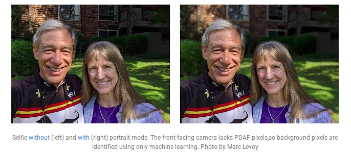
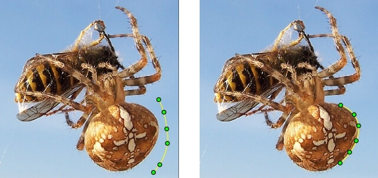

# 15-418 Final Project Proposal Checkpoint}

## Overview

We have decided to build bokeh portrait mode in parallel.

Bokeh portrait mode has been popularized largely by DSLR cameras, where the
foreground of the subject is in focus and the background is blurred by bokeh
shapes. Up until recently, images with bokeh portrait mode had to be taken from
high end DSLR cameras that cost up to thousands of dollars. But now, portrait
mode has been integrated into smartphones, with the foreground detection and
blur done mainly with image processing. (Google Pixel 2) Many smartphones in
the market currently use multiple cameras (IPhone X) for depth detection but
our project will focus on the image processing method.

Portrait mode can be seperated into two main steps. The first is the segment
the given image into a foreground and background. Segmentation is done in order
to replicate the DSLR camera being able to capture foregrounds in focus and
backgrounds out of focus. The second is the bokeh blur, which is applied to the
background parts of the image. A bokeh blur must be calculated with a polygon,
in order to replicate the fractions of light let through the specific apertures
a DSLR camera.

We believe that parallelism can be utilized in both of these steps. For the
blur, the entire region can be entirely completed in parallel as there are
little dependencies after the blur process. Depending on which segmentation
algorithm we utilize (options explained in next section), we will also
implement it in parallel to achieve speedup.

## Part 1: Segmentation

There are several different implementations of foreground/background removal
and extraction algorithms. In order to maximize parallelism and due to our lack
of knowledge for machine learning, we will focus on classic computer vision
methods rather than identifying foreground with convolutional neural nets.

Some of the main algorithms we have looked at are active contour methods
(snake), principle component analysis, and graph cut algorithms.

We will most likely implement the active contour method, as it is the easiest
to implement. The algorithm uses a spline known as a snake that is influenced
by energy values in the image calculated by the pixel values. Essentially,
snakes start from the outside of an image as a line and try to continue towards
the center. If it believes there is not that large of a pixel difference with
what it has seen previously, it proceeds towards the center. Otherwise, it
stops because it believes it has reached the foreground of the image.

In terms of computation, a gradient of the pixels must be first calculated in
order to find differences in pixel values. This gradient can be heavily
parallelized with CUDA. The gradient is then used in order to calculate lines
and edges in the images, which are contours that the snake uses to determine
its energy and the energy of the pixels in the image. The energy is then used
to make decisions for the points of a snake.

An alternative way to calculate the energy is to apply the Canny Edge Detection
Algorithm. It first applies a filter to remove noise in the image, finds
intensity gradients taking derivatives of the pixels, applies non- maximum
suppression, applies thresholds to find potential edges, and removing weak
edges not connected to strong edges. Finding intensity gradients involves
convolving filters in the image to detect the vertical, horizontal and diagonal
edges. A version of the canny edge detection algorithm is implemented in
OpenCV. This can be used to benchmark our parallel performance.

Each point of the snake has its own energy and the decision to move the point
is independent to the other points of the snake, so there is opportunity to
utilize parallelism. OpenMP can be utilized here if there are around 12 points
used in the snake. There are several implementations of active contour, mainly
with OpenCV, which can be benchamrked against for performance.

Other methods of segmentation seemed much more challenging to implement. We
looked into Principle Component Analysis. And also the default implementaton of
foreground extraction on OpenCV, with graph cuts.

By the proposal, we will have solidified the algorithm we will use for
segmentation.

## Part 2: Bokeh Blur

The Bokeh effect is implemented by applying a filter in the shape of a polygon
across an image. Values are accumulated by shifting the image in a shape and
computing a weighted sum. This can be heavily parallelized across CUDA.

## Hardware

We will use the gates machines, as they have GPUS if we use CUDA and a high
number of hyperthreads for OMP processing.

## Overall

Overall, we are looking to use CUDAs on GPUs because we are often able to
parallelize across all the pixels of an image to apply all our filters and
algorithms.

However, we are open to trying OpenMP and seeing if it gives us speedup for
algorithms like the snake active contour map, where there is not as many points
to parallelize over.

Some of the challenges will be finding speedup across every step of the
portrait mode process, from segmentation to bokeh blur. This is because Amdahls
law and having overall speedup by limited by the slowest parts. Additionally,
we are required to syncrhonize after each of the major steps, which leads to
additional time being used. We must have each CUDA core process an individual
part of the image as much as possible to reduce this. Like in assignment 2, we
have to find the best way to map the CUDA cores to the image, in order for
optimal shared memory and cache access.

## Citations

- https://research.googleblog.com/2017/10/portrait-mode-on-pixel-2-and-pixel-2-xl.html
- https://en.wikipedia.org/wiki/Active_contour_model
- http://opencv-python-tutroals.readthedocs.io/en/latest/py_tutorials/py_imgproc/py_canny/py_canny.html
- http://eric-yuan.me/active-contour-snakes/
- https://github.com/fastai/numerical-linear-algebra/blob/master/nbs/3.%20background%20removal%20with%20robust%20pca.ipynb
- http://cdn.intechopen.com/pdfs/30443.pdf
- https://docs.opencv.org/trunk/d8/d83/tutorial_py_grabcut.html
- https://dl.acm.org/citation.cfm?id=1015720
- https://www.scratchapixel.com/lessons/digital-imaging/simple-image-manipulations/bookeh-effect
