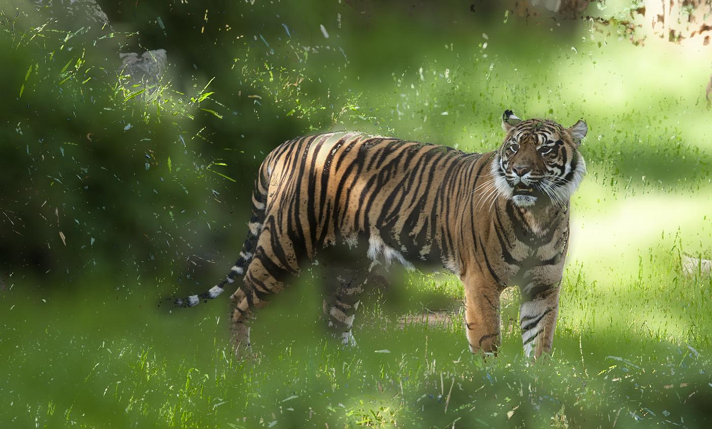

# 15-418 Final Project Checkpoint 01

## Progress Review

We have finished the sequential implementation of our algorithm in Python.
(NumPy) This includes both the segmentation and the blur. We are currently
working on the C implementation and brainstorming ways to use CUDA for
parallelism.

Input Image

Output Portrait Mode Image

Through implementing the algorithm, we have found that we had to make several
changes to our original design. For segmentation, we realized that using edges
and gradients with snakes was not giving us the results we wanted. Much of the
foreground was not captured by the snake and each point was too far apart form
a continuous mask for the foreground.

Edges Found

Snake Outline From Edges

Snake Outline From Pixel Gradient

So, we decided to revise our algorithm. We chose to implement a simplified
grab-cut algorithm.

1.  Designiate the borders of the image as the background.
2.  Get a color distribution of the background region. Group colors together
    based on a certain threshold.
3.  Filter colors that make up less than 1 percent of the background area.
4.  Create a foreground mask by finding every pixel with a color not
    in the background color distrubution.
5.  For every unmasked pixel, add it to the mask if two of its neighboring
    pixels were part of the mask.
6.  Blur all the pixels that are not within the foreground mask. (We have
    tried a box filter, gaussian filter, and bokeh filter and a large box
    gives us the best results)
7.  For each pixel in the mask, add the original pixel of the image into
    the blurred version of the image.

Foreground Mask (Step 5)

Most of the time in the last week was spent ironing out the computer vision
algorithm and trying to balance accuracy with how generalizable the algorithm
was. We tried many other methods like using a background only image with a
background / foreground image, but we finalized what we have now moving foward.

## Goals

We took an additional 2 days to complete our goal of implementing the python
version, but we have completed it. We are confident we can finish the C
implementation by the end of the week. Once we optimize array patterns and
convolutions in C, we will start CUDA implementation. We are not sure of the
"nice to have" portrait mode on gifs or videos, but we will decide by the next
checkpoint.

## Revised Schedule

| Date       | Item                                                     |
|------------|----------------------------------------------------------|
| 2018-04-11 | Proposal                                                 |
| 2018-04-17 | Sequential Python: background detection and manipulation |
| 2018-04-20 | Sequential C: background detection and manipulation      |
| 2018-04-23 | Parallel CUDA: background color distribution extraction  |
| 2018-04-28 | Parallel CUDA: background mask                           |
| 2018-05-05 | Parallel CUDA: applying mask and blur                    |
| 2018-05-06 | Parallel CUDA: background manipulation                   |
| 2018-05-07 | Writeup and poster                                       |
| 2018-05-08 | Presentation                                             |

## Deliverables

We will be able to implement the CUDA implemnetation of portrait mode. We plan
to show a gallery of before an examples for input image and output portrait
mode images. We are not sure of the exact speedup between the CUDA
implementation with the sequential C, but believe it will be significant with
the high number of iterations across every pixel with background distribution
and blur. We also plan on comparing the performance differences between
sequential python with CUDA and sequential C.

## Issues

Our current algorithm performs very well on some images, but on others it does
not do as well. When the colors composing the subject are similar to the ones
in the background, we have trouble distinguishing the two.

Additionally, we sometimes notice small objects in the background with unusual
colors being identified as the foreground

We may try to use a hybrid strategy using both our modified grab-cut algorithm
and snakes to try to better identify the subject, or attempt to implement logic
to ignore small, isolated "foreground" objects. Or, we may decide to limit our
scope to images that work well with our current algorithm and focus on
parallelization.

As for the parallelization we have left to do: Due to the structure of the
problem and the low amount of competition when writing to the final blurred
image, we think we may see significant speedup on the final blurring step.
However, in order to blur a single pixel, we have to look at many neighboring
pixels. This may present a challenge, and we may wish to decrease the number of
pixels each pixel looks at as it blurs.

The gathering of background color info is also likely to be a challenge. Here,
we do have a significant amount of sequential-ness and dependency. We will have
to think of creative ways to identify which colors are background colors in a
parallelization way. Some preliminary thoughts we have are to set up a lookup
table mapping ranges of colors to number of times encountered in the image,
break the image into many small blocks, locally update the counts, and coalesce
the counts at the end into the final global table.

## Sample Results Gallery

Input Image

Output Portrait Mode Image

Input Image

Output Portrait Mode Image
