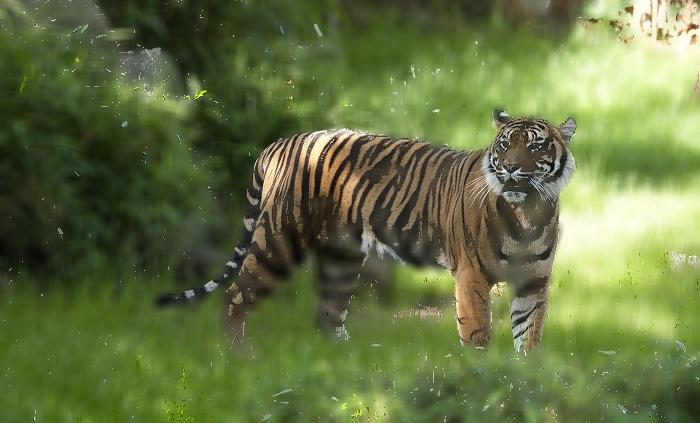
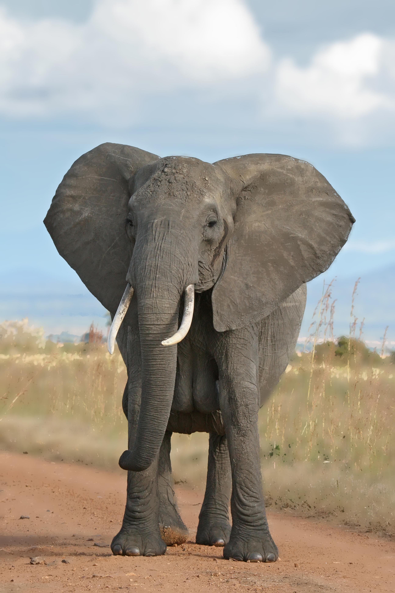

# 15-418 Final Project Checkpoint 02

## Progress Review

We have finished both the sequential C implementation and parallel CUDA
implementation of our algorithm.

We have verified that all three implementations produce the same, bit-for-bit
results on a given input image.

In order to avoid any encode/decode steps when working with JPEG, we modified
the algorithm to work with PPM, which is an image format we used in Assignment
1 and is much easier to work with.

We saw a significant amount of speedup between the sequential Python and
sequential C implementations. Then, after completing the CUDA implementation,
we saw more impressive speedups. In the CUDA implementation, we took advantage
of shared memory for our blur convolutions and synchronized threads between
the load and blur steps.

## Preliminary Results

Below, we have summarized some results. Although the speedup from Python to C
is also impressive, we do not explicitly include it in the table below because
the focus of the project is to consider the speedup gained specifically by
utilizing parallelism, not by choosing a ``fast'' language. We have also
omitted some python results because they take too long to run.

Images are with 50x50 size blur

| Image          | Size      | Python | C       | Cuda   | Speedup |
|----------------|-----------|--------|---------|--------|---------|
| Elephant       | 389x584   | 51m10s | 2.84s   | 0.345s | 8.23x   |
| Tiger          | 1400x845  | -      | 18.1s   | 0.328s | 55.19x  |
| Large Elephant | 2594x3888 | -      | 134.37s | 1.040s | 129.17x |

Time Breakdown in seconds for Large Elephant

| Task             | C        | Cuda   | Speedup  |
|------------------|----------|--------|----------|
| Load Image       | 0.5091   | 0.0132 | -        |
| CUDA Move Memory | -        | 0.1734 | -        |
| Generate Mask    | 0.1376   | 0.0963 | -        |
| Blur             | 136.9151 | 0.2244 | 601.139x |
| Write Image      | 0.3073   | 0.4284 | -        |

Because of our time breakdown, we are spending the most time in writing the
image result, which cannot be parallelized. Also, we believe the overhead of
moving the memory into the GPU for generating the mask will take more time than
sequential, due to the CUDA Move Memory time. We will verify if this is the
case.

## Goals

We have essentially completed all the goals we set out to accomplish in our
proposal. However, we still have time left to work on the project.

We would like to try using OpenMP as a source of parallelism to achieve speedup
in running our algorithm. We will revise the sequential C program to add OpenMP
pragmas, and compile sequential C and OpenMP-enabled C versions of the program
separately, as in Assignment 3.

We are interested as to what kinds of speedups we will see from sequential C to
OpenMP-enabled C. We expect there to be fairly significant speedups, but not on
the order of what we saw with CUDA, because our algorithm is basically various
image manipulations operations, and GPUs were originally designed to be able to
quickly execute such image manipulations.

We believe with the OpenMP approach of having less threads and less overhead of
moving data to a GPU, we can achieve more parallelism with the segmentation
part of our algorithm. However, most of the time is spent on blur, so this the
resulting speedup will not be as high.

Additionally, we are looking to implement the algorithm in ISPC if we have
time. If we have extra time, we can apply the algorithm to a video to show that
is able to run in live-time.

## Revised Schedule

| Date       | Item                                                     |
|------------|----------------------------------------------------------|
| 2018-04-11 | Proposal                                                 |
| 2018-04-17 | Sequential Python: background detection and manipulation |
| 2018-04-20 | Sequential C: background detection and manipulation      |
| 2018-04-23 | Parallel CUDA: background blur                           |
| 2018-04-25 | Parallel CUDA: optimizing with shared memory             |
| 2018-04-27 | Parallel CUDA: final optimizations                       |
| 2018-04-29 | Parallel OMP: background detection and manipulation      |
| 2018-05-04 | Parallel ISPC: background detection and manipulation     |
| 2018-05-06 | Possibly Video                                           |
| 2018-05-08 | Presentation                                             |

## Deliverables

We have met our goal of implementing portrait mode in CUDA. We will likely be
able to implement the OMP and ISPC versions of the algorithm and compare the
results. It will be interesting to discuss how each framework's approach to
parallelism causes different speedup in different parts of the code. We have
been able to show 130x speedup with CUDA, but we anticipate OMP and ISPC to
only be able to achieve around 30x speedup due to GPUS having more
computational threads.

We plan to show a gallery of before an examples for input image and output
portrait mode images.

## Issues

One issue may be if we feel a need to have our regular C program and OpenMP-
enabled C program diverge significantly. We may wish to use `#if OMP` pragmas
to separate OpenMP-only logic from regular sequential logic. We hope, however,
to keep the algorithms as similar as possible. Ideally, the only change would
be to add the OpenMP pragmas.

If we wish to run our algorithm on videos, a possible problem may be that even
the fastest version of the algorithm may not be able to run in real-time. Even
for relatively small images such as Elephant and Tiger, the program runs in
more than 1/30 of a second, meaning we may not be able to process 30
frames per second, a common standard for video. 60 or 120 frames per second
would be even better, but also even less likely.

We also foresee that it will be non-trivial to decode a video into frames for
our algorithm to process. Even if we were to scale back our ambitions and only
run our algorithm on existing video files, rather than with a real-time camera,
the way in which we handle various video formats will require research.

## Sample Results Gallery

Large Tiger Result (0.328s)

Large Elephant result (1.04s)
